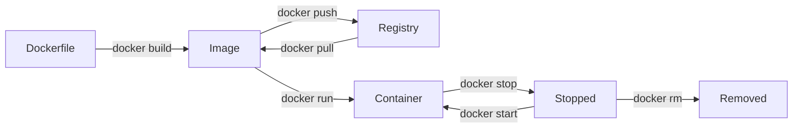

# Docker — Container Platform

Docker is the industry-standard container platform that enables developers to package applications and their dependencies into lightweight, portable containers that run consistently across any environment.

## Core Architecture

Docker uses a client-server architecture:

- **Docker Daemon** (`dockerd`): Background service managing containers, images, networks, and volumes
- **Docker CLI** (`docker`): Command-line interface that communicates with the daemon via REST API
- **Docker Registry**: Storage and distribution system for container images (default: Docker Hub)

## Container Lifecycle



## Docker Compose

For multi-container applications, `docker compose` defines services, networks, and volumes in a YAML file:

```yaml
# docker-compose.yml
version: "3.9"
services:
  web:
    image: nginx:alpine
    ports:
      - "80:80"
  database:
    image: postgres:15
    environment:
      POSTGRES_DB: myapp
      POSTGRES_PASSWORD: secret
    volumes:
      - db-data:/var/lib/postgresql/data
volumes:
  db-data:
```

```bash
# Start all services
docker compose up -d

# View logs
docker compose logs -f

# Tear down
docker compose down -v
```

## Security Best Practices

- Never run containers with `--privileged` in production
- Use read-only root filesystems (`--read-only`)
- Drop unnecessary Linux capabilities (`--cap-drop ALL`)
- Scan images for vulnerabilities (`docker scan` or Trivy)
- Use distroless or scratch base images to reduce attack surface

## Related Tools

- **[podman](../../container/image/podman.md)** — Daemonless container engine (drop-in Docker replacement)
- **[kubernetes](../../container/orchestration/kubernetes.md)** — Container orchestration platform
- **[docker-compose](../../container/orchestration/docker-compose.md)** — Multi-container application definition
